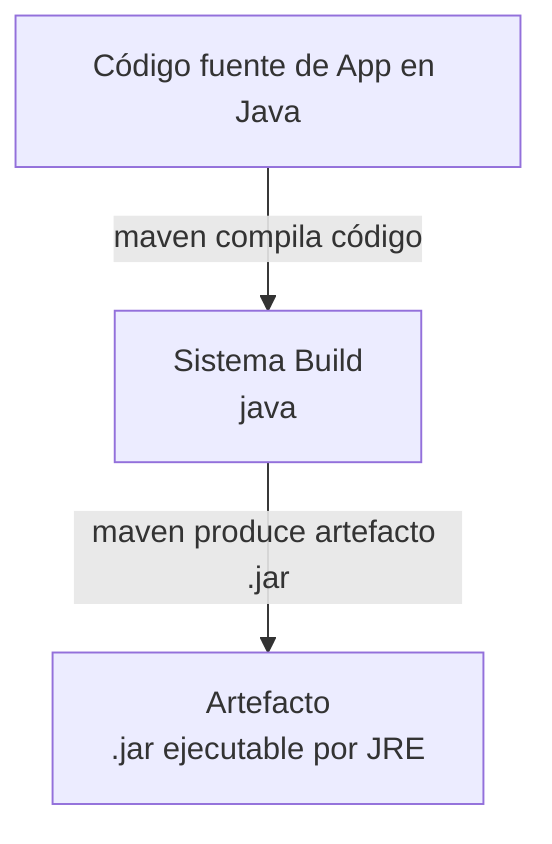

# Herramientas-de-Sistemas-de-Construccion-Maven

**Índice**

1. [Objetivos](#objetivos)
1. [Resultados de Aprendizaje y Criterios de Evaluación](#resultados-de-aprendizaje-y-criterios-de-evaluación)
1. [Infraestructura y herramientas a utilizar](#infraestructura-y-herramientas-a-utilizar)
1. [¿Que es store App?](#qué-es-store-app)
1. [¿Que es Maven?](#qué-es-maven)
1. [Preparar laboratorio](#preparar-laboratorio)
1. [Estructura de un proyecto Maven](#estructura-de-un-proyecto-maven)
1. [Analizando el archivo pom.xml](#analizando-el-archivo-pomxml)
1. [Ciclo de vida `default` de Maven](#ciclo-de-vida-default-de-maven)
1. [Ciclo de vida `clean` de Maven](#ciclo-de-vida-clean-de-maven)
1. [Ciclo de vida `site` de Maven](#ciclo-de-vida-site-de-maven)
1. [Dejando todo en órden](#dejando-todo-en-órden)

---
# OBJETIVOS

- Comprender qué es Maven y cuál es su función en un proyecto Java.

- Identificar la estructura básica de un proyecto Maven.

- Reconocer el papel del archivo pom.xml como núcleo de configuración.

- Entender cómo Maven gestiona dependencias y plugins.

- Distinguir las fases principales del ciclo de vida por defecto.

- Ejecutar comandos básicos de Maven para compilar, probar y empaquetar un proyecto.

- Relacionar cada fase del ciclo de vida con una tarea concreta del proceso de construcción.

- Valorar la utilidad de Maven para estandarizar y automatizar el desarrollo.

---
# RESULTADOS DE APRENDIZAJE Y CRITERIOS DE EVALUACION

Esta actividad se relaciona con el resultado de aprendizaje y criterios de evaluación RA5 d.

---
# INFRAESTRUCTURA Y HERRAMIENTAS A UTILIZAR.

**Infraestructura Técnica Integrada**

LABORATORIO:  



**Componentes de la Infraestructura**


| Componente   | Función              |  
| ------------ | -------------------- |  
|  .java       | Archivos a compilar  |  
|  Maven       | Herramienta Build    |  
|  .jar        | Artifact o archivo ejecutable por M.V. Java  |   


**Flujo Trabajo**

1. Preparar laboratorio.
1. Descomprimir el proyecto app-store.
1. Revisar brevemente la estructura del proyecto.
1. Identificar el pom.xml y el papel de Maven en el proyecto.
1. Ejecutar Maven en local para construir la aplicación.
1. Veer los diferentes ciclos de vida de Maven: default, clean y site.
1. Lanzar la aplicación localmente o comprobar el artefacto generado.


Relacionar cada paso con el flujo real: código → build → artefacto → imagen → ejecución.

---
# ¿QUÉ ES Store APP?

**Store APP** es una aplicación de Android diseñada para ser intencionalmente vulnerable.  

El objetivo de crear esta aplicación es enseñar a los desarrolladores y profesionales de la seguridad sobre las vulnerabilidades presentes en las aplicaciones modernas de Android.
Es una aplicación escrita en java y tienes el [archivo comprimido, store-app.zip en la carpeta files](./files/store-app.zip)

Ya hemos trabajado con ella en la [Tarea de la Unidad 3](../../Unidad3-VulnerabilidadesWeb/TareaUnidad3/README.md), pero ahora vamos a darle significado a las operaciones que realizamos en ese momento.

---
# ¿QUÉ ES MAVEN?

**Maven** es una herramienta que automatiza todo el proceso de construcción de proyectos Java, desde descargar dependencias hasta generar el archivo ejecutable final (`.jar`, `.war`). Su archivo central `pom.xml` define dependencias, plugins y el orden de ejecución.

**¿Qué automatiza Maven?**

- Descarga bibliotecas desde repositorios como Maven Central.
- Compila el código fuente.
- Ejecuta pruebas unitarias.
- Empaqueta todo en un artefacto desplegable.
- Genera documentación y estadísticas.

Ventaja clave: un solo comando (mvn package) ejecuta todo el proceso de forma repetible en cualquier máquina. Maven sigue un ciclo de vida fijo (compile → test → package → install → deploy) donde cada fase ejecuta automáticamente las anteriores necesarias. Vamos a verlas en esta actividad.

En nuestro caso, Maven construye la app-store vulnerable que ya conocéis, preparando el .jar que luego Docker empaqueta en la imagen final.

---
# PREPARAR LABORATORIO

1. Situate en la carpeta donde realices las actividades y crea una carpeta para el proyecto y te situas en ella:

```bash 
# crea variable con tu nombre
TuNombre=Aquí_Pones_Tu_Nombre
# Creamnos carpeta
mkdir -p Unidad5/Actividad-Maven
# Nos colocamos en ella
cd Unidad5/Actividad-Maven
```

La aplicación `store-app` que estamos utilizando está escrito en `Spring`y como hemos visto en el `pom.xml` está escrito para ejecutarse con `java 11`. Por ello necesitamos tener instalado `java 11` para poder ejecutarlo.

2. Comprobamos si tenemos instalado java 11 en nuestro equipo:

```bash
update-alternatives --list java
```


Si la tenemos instalada nos aparecerá ahí.

3. Si no lo tenemos, lo hacemos.

```bash
sudo apt update
# Instalamos Java 11.
sudo apt install openjdk-11-jdk maven
```
4. Le indicamos al sistema que queremos usar java 11

```bash
# elegimos java-11
sudo update-alternatives --config java
# elegimos java-11
sudo update-alternatives --config javac
```


5. Descomprime la aplicación, la tienes [aquí](./files/store-app.zip)

```bash
# coloca store-app.zip en la carpeta
# descomprime 
unzip store-app.zip 
# comprueba que se ha descomprimido
ls -l store-app
```


6. Comprueba que tienes instalado `Maven`:

```bash
# comprobamos versión de maven
mvn --version
# sino tenemos instalamos
# sudo apt udate; sudo apt install maven 
```


---
# ESTRUCTURA DE UN PROYECTO MAVEN

1.Revisar brevemente la estructura del proyecto.

```bash
cd store-app
# hacemos listado en forma de árbol del proyecto
tree 
```


como vemos, la estructura de una aplicación java es algo así:

```
mi-proyecto/  
├── pom.xml  
├── src/  
│   ├── main/  
│   │   ├── java/  
│   │   └── resources/  
│   └── test/  
│       ├── java/  
│       └── resources/  
└── target/  
```

**Elementos importantes:**

**Archivos y carpetas importantes:**
- **`pom.xml`**: es el archivo principal de Maven; define el proyecto, sus dependencias, plugins y ciclo de construcción.

- **`src/main/java/`**: contiene el código fuente principal de la aplicación, organizado normalmente por paquetes Java.

- **`src/main/resources/`**: guarda recursos no Java que necesita la aplicación, como application.properties, ficheros XML, plantillas o configuraciones.

- **`src/test/java/`**: contiene el código de pruebas, por ejemplo tests unitarios con JUnit.

- **`src/test/resources/`**: incluye recursos usados solo en los tests, como datos de prueba o configuraciones específicas.

- **`target/`**: es la carpeta que Maven genera al compilar; ahí aparecen los .class, .jar, .war y otros artefactos temporales o finales del build.

**Si es una aplicación web:**
` src/main/webapp/`: aparece en proyectos web tradicionales y contiene recursos web como JSP, HTML, CSS, JavaScript y WEB-INF.

---
# ANALIZANDO EL ARCHIVO `pom.xml`. 

Este [`pom.xml`](./files/pom.xml) **configura toda la construcción**: qué bibliotecas necesita, cómo compilar, cómo empaquetar y hasta cómo inicializar la base de datos Derby.  

Analizando el `pom.xml`  estos son **los elementos más importantes**:

1. **Identificación del proyecto**

```yml
<groupId>es.storeapp</groupId>
<artifactId>store-app</artifactId>
<version>1.0.0</version>
<name>Store Application</name>
```

**Qué significa:** Este es el proyecto `store-app` versión `1.0.0` del grupo `es.storeapp`. Es la "coordenada Maven" única que identifica el artefacto en repositorios.

2. **Parent: Spring Boot**

```yml
<parent>
    <groupId>org.springframework.boot</groupId>
    <artifactId>spring-boot-starter-parent</artifactId>
    <version>2.0.5.RELEASE</version>
</parent>
```

**Qué significa:** Hereda toda la configuración por defecto de Spring Boot 2.0.5. Incluye versiones preconfiguradas de dependencias, plugins y mejores prácticas.

3. **Dependencias principales**

```yml
spring-boot-starter-web
spring-boot-starter-thymeleaf
spring-boot-starter-data-jpa
spring-boot-starter-test
spring-boot-starter-actuator
```

**Qué significa:**

- **web**: servidor web embebido y controladores REST.
- **thymeleaf**: motor de plantillas para vistas HTML.
- **data-jpa**: acceso a base de datos con JPA/Hibernate.
- **test**: JUnit y herramientas de pruebas.
- **actuator**: endpoints de monitoreo y salud.


4. **Dependencias externas específicas**

```yml
org.apache.derby:derby
org.mindrot:jbcrypt
org.apache.commons:commons-email
```

**Qué significa:**

- **derby**: base de datos embebida para desarrollo.
- **jbcrypt**: encriptación de contraseñas.
- **commons-email**: envío de emails.


5. **Dependencias web (WebJars)**

```yml
bootstrap 4.0.0-2
jquery 3.3.1-1
font-awesome 5.0.6
datatables 1.10.16
```

**Qué significa:** Bibliotecas JavaScript y CSS servidas como dependencias Maven. Se empaquetan automáticamente en el .jar.

6. **Plugins importantes**

```yml
spring-boot-maven-plugin
maven-assembly-plugin
sql-maven-plugin
```

**Qué significa:**

- **spring-boot-maven-plugin**: genera el .jar ejecutable con servidor embebido.
- **assembly**: crea distribuciones personalizadas.
- **sql-maven-plugin**: inicializa la base de datos Derby con `tables.sql` y `data.sql`.


7. **Configuración del compilador**

```yml
<java.version>11</java.version>
<maven.compiler.source>11</maven.compiler.source>
<maven.compiler.target>11</maven.compiler.target>
```

**Qué significa:** Compila para Java 11, codificación UTF-8.

**Resumiendo:**

```yml
 store-app 1.0.0 (Spring Boot 2.0.5)
├──  Dependencias: web + thymeleaf + JPA + Derby + BCrypt
├──  WebJars: Bootstrap 4 + jQuery + DataTables
├──  Plugins: spring-boot + assembly + sql
└──  Java 11
```

---
# CICLO DE VIDA `Default` DE MAVEN

El ciclo **default** de Maven es el ciclo principal de construcción: valida el proyecto, compila el código, ejecuta pruebas, empaqueta el artefacto, lo verifica, lo instala en el repositorio local y, si corresponde, lo despliega.

Como vimos en los contenidos teóricos, las diferentes etapas del ciclo  de un proyecto Maven de una app se pueden ver en la siguiente imagen:  


En Maven, cuando ejecutas una fase, **también ejecutan todas las anteriores** del mismo ciclo de vida. Por ejemplo, si lanzas `mvn package`, Maven habrá pasado antes por `validate`, `compile` y `test`.  
Por lo tanto el **ciclo vida `default` de Maven realiza**: **validate -> compile -> test -> package -> verify -> install  -> verify** si bien estos dos últimos se referían a la copia del **paquete generado** a los repositorios local y remoto.

Recordamos también que en el caso de `Java` en la etapa **package** se generan uno o varios **artifact** con la aplicación empaquetada (normálmente un .jar).

## Validate
**mvn validate**: Valida que el proyecto sea correcto y que toda la información necesaria esté disponible.
Para ello, revisa la estructura, `pom.xml`, configuración básica y disponibilidad de elementos necesarios para el build.

```bash
# compilamos
mvn validate
```


Como vemos en nuestro caso nos avisa de que ha encontrado problemas, en este caso sólo `warnings` asociado que no se encuentran disponibles los plugins de `org.codehaus.mojo:sql-maven-plugin`.

## Compile

**mvn compile** compila el código fuente principal de `src/main/java`.
Intervienen también los recursos que se encuentran en `src/main/resources/` y `target/classes/`

Se construyen las clases compiladas `.class`  y se colocan en `target/classes/`.


```bash
# compilamos
mvn compile
# vemos las clases generadas
ls target/classes
# o si queremos verlas en forma de árbol
tree target/classes
```


## Test

**mvn test**: Ejecuta las pruebas unitarias del proyecto.

- Compila los test que se encuentran en `src/test/java`.  

- Se construyen los test compilados y se guardan en `target/test-classes/`

- La aplicación comprimida store-app no tiene test unitarios de prueba. Vamos a **crear un archivo de pruebas** para probar `mvn test`.

A continuación tienes el archivo de pruebas, lo tienes que colocar en:
src/test/java/es/storeapp/business/entities/OrderTest.java
```bash 
# creamos el directorio
mkdir -p src/test/java/es/storeapp/business/entities
# editamos el archivo y ponemos dentro de él el contenido
nano src/test/java/es/storeapp/business/entities/OrderTest.java

```
```java
package es.storeapp.business.entities;

import java.util.ArrayList;
import java.util.List;

import static org.junit.Assert.assertEquals;
import static org.junit.Assert.assertNotNull;
import static org.junit.Assert.assertTrue;
import org.junit.Before;
import org.junit.Test;

public class OrderTest {

    private Order order;

    @Before
    public void setUp() {
        order = new Order();
    }

    @Test
    public void testSetAndGetOrderId() {
        order.setOrderId(1L);
        assertEquals(Long.valueOf(1L), order.getOrderId());
    }

    @Test
    public void testSetAndGetName() {
        order.setName("Pedido 1");
        assertEquals("Pedido 1", order.getName());
    }

    @Test
    public void testSetAndGetTimestamp() {
        Long timestamp = System.currentTimeMillis();
        order.setTimestamp(timestamp);
        assertEquals(timestamp, order.getTimestamp());
    }

    @Test
    public void testSetAndGetPrice() {
        order.setPrice(100);
        assertEquals(Integer.valueOf(100), order.getPrice());
    }

    @Test
    public void testSetAndGetAddress() {
        order.setAddress("Calle Falsa 123");
        assertEquals("Calle Falsa 123", order.getAddress());
    }

    @Test
    public void testSetAndGetState() {
        OrderState state = OrderState.PENDING; // Ajusta si cambia el enum
        order.setState(state);
        assertEquals(state, order.getState());
    }

    @Test
    public void testSetAndGetUser() {
        User user = new User();
        order.setUser(user);
        assertEquals(user, order.getUser());
    }

    @Test
    public void testOrderLinesInitialization() {
        assertNotNull(order.getOrderLines());
        assertTrue(order.getOrderLines().isEmpty());
    }

    @Test
    public void testSetAndGetOrderLines() {
        List<OrderLine> lines = new ArrayList<>();
        lines.add(new OrderLine());

        order.setOrderLines(lines);

        assertEquals(1, order.getOrderLines().size());
        assertEquals(lines, order.getOrderLines());
    }

    @Test
    public void testToStringNotNull() {
        order.setOrderId(1L);
        order.setName("Pedido");
        order.setTimestamp(123456L);
        order.setPrice(50);
        order.setAddress("Dirección");
        order.setState(OrderState.PENDING);
        order.setUser(new User());

        String result = order.toString();

        assertNotNull(result);
        assertTrue(result.contains("Pedido"));
        assertTrue(result.contains("50"));
    }
}
```

- Ejecutamos `mvn test`

```bash
# ejecutar mvn test
mvn test
# vemos las clases de test generados
tree target/classes
```


Como puedes ver descarga las dependencias necesarias y ejecuta las pruebas unitarias, que se ejecutan sin errores.


## Package

**mvn package**: empaqueta el proyecto en su formato distribuible, por ejemplo un `.jar` o `.war`.

- Lo normal es que se construya un `.jar` dentro de `target/`

- Ejecutar 

```bash
# ejecutar package
mvn package
# comprobar archivo store-app-1.0.0.jar creado
ls -l target/
```


> ¡¡¡Observa cómo se realizan las operaciones anteriores: validate, compile y test y como tarda bastante más tiempo en ejecutar la creación del paquete!!!

- Se crea el paquete `store-app-1.0.0.jar` que ya puede ser ejecutado por la MV de Java.


## Verify

**mvn verify**: ejecuta comprobaciones adicionales para validar que el paquete generado es correcto y cumple ciertos criterios de calidad.

- Puede incluir validaciones, pruebas de integración o chequeos extra si hay plugins configurados para ello.

- Utiliza el .jar y el pom.xml para verificación y puede modificar metadatos en la carpeta de maven /home/TuNombre/.m2

```bash
# ejecutar verify
mvn verify
# ver carpeta de maven
ls -la /home/$TuNombre/.m2/repository
```


## Install

- **mvn install**: copia el artefacto empaquetado al repositorio local de Maven para que otros proyectos del mismo equipo o equipo local puedan usarlo como dependencia.

```bash
# ejecuta isntall
mvn install
# comprobamos estructura creada 
tree ls -la /home/$TuNombre/.m2/repository/es/store-app

```
)

## Deploy
- **mvn deploy**: Copia el fichero .jar a un servidor maven remoto, poniéndolo disponible para cualquier proyecto maven con acceso a ese servidor remoto.

Como no tenemos acceso a ninguno, aquí no hacemos nada.


---
# EJECUCIÓN DE LA APLICACIÓN.


**Opción 1: arrancar con Maven**

Si el proyecto es Spring Boot, lo normal es poder lanzarlo con el plugin correspondiente.

```bash
mvn spring-boot:run
```
Esto compila y arranca la aplicación con el servidor embebido de Spring Boot.


**Opción 2: empaquetar y ejecutar el `.jar`**

- Construir el proyecto y después ejecutar el `.jar` generado:

```bash
# limpiamos y construimos el proyecto
mvn clean package
# Ejecutamos el `.jar` generado
java -jar target/store-app-1.0.0.jar
```


**Opción 3: ejecutar el `.jar` con un contenedor docker**

```bash 
docker run --rm -p 8888:8888 \
  -v "$(pwd)/target/store-app-1.0.0.jar:/app/app.jar" \
  -v "$(pwd)/work:/app/work" \
  -w /app \
  eclipse-temurin:11-jre \
  java -jar /app/app.jar
```

- monta el .jar en /app/app.jar,
- monta una carpeta local work/ en /app/work,
- establece /app como directorio de trabajo,
- redirecciona el puerto 8888 para visualizar la aplicación.
- una vez creado ejecuta la orden `java -jar /app/app.jar` para ejecutar la app.

## Acceder a la aplicación 

Accedemos a la aplicación a través de nuestro puerto 8888: http://localhost:8888


- Finalizamos la aplicación pulsando `Ctrl + c` en el terminal.

---
# CICLO DE VIDA `Clean` DE MAVEN

**mvn clean** borra clases compiladas, documentación y artefacto empaquetado.
Evita problemas:
- Clases .class corruptas de builds interrumpidos.
- Artefactos .jar de versiones anteriores.
- Dependencias mal copiadas.
- Estados inconsistentes entre máquinas.


Subfases:  **pre-clean → clean → post-clean**

## mvn clean
**mvn clean** borra el contenido completo del directorio target/, que contiene:

```
target/
├── classes/           <- .class compilados
├── test-classes/      <- .class de tests
├── miapp-1.0.jar      <- artefacto empaquetado
├── surefire-reports/  <- informes de tests
├── site/              <- documentación generada
└── maven-*.log        <- logs temporales
```

> **mvn clean package** realiza un ciclo `clean` + ciclo `default` hasta package, es decir: **Limpia + compila + tests + empaqueta**

---
# CICLO DE VIDA `Site` DE MAVEN

`mvn site` ejecuta todas las fases del lifecycle site:

**pre-site → site → post-site → site-deploy** (opcional)


La fase `site` es la que genera todo el contenido. Maven usa plugins de reporting configurados en el `pom.xml` para generar cada sección.

Recoge información de:
1. Información del `pom.xml`.
2. Código fuente: 
    - Javadoc se genera del código fuente Java (comentarios /** */).
    - Unidad tests generan su propio Javadoc paralelo.
    - Cobertura de código (si tienes plugins como Cobertura, JaCoCo).
3. Ejecución de plugins de reporting: cada plugin configurado en <reporting> del `pom.xml` genera su informe

**Información generada:**

```
target/site/
├── index.html                 <- página principal del proyecto
├── project-info.html          <- resumen del proyecto (pom.xml)
├── dependencies.html          <- árbol de dependencias
├── license.html               <- licencias
├── source-repository.html     <- SCM info
├── team.html                  <- developers/contributors
├── issue-tracking.html        <- issue management
├── integration.html           <- CI/CD info
├── project-reports.html       <- listado de todos los informes
├── javadoc/                   <- documentación Java completa
├── surefire-report.html       <- resultados de tests
└── checkstyle.html            <- análisis estático (si configurado)
```
Para ejecutar la construcción de la documentación:

```bash
# ejecuta el ciclo site para generación de documentación
mvn site
# nos cambiamos a la carpeta de la web generada y comprobamos documentación generada en target/site
cd target/site
tree 
# levantamos un servidor php para visualizarla
php -S 0:8080
# Para finalizar el servidor php pulsar Ctrl + C
```


Accedemos a la documentación: http://localhost:8080


---
# DEJANDO TODO EN ÓRDEN

Volvemos a dejar la versión de java que teníamos:

```bash
# Dejábamos el java que teníamos
sudo update-alternatives --config java
# Dejábamos el java que teníamos
sudo update-alternatives --config javac
```